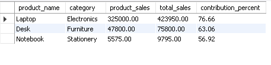
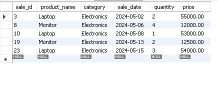

# 🚀 CODTECH Internship – Task 2: DATA ANALYSIS WITH COMPLEX QUERIES

This repository contains SQL scripts and outputs for **Task 2** of my SQL internship at **CODTECH IT Solutions**.

## 📢 Author

- **Name:** AAYUSH BANSAL  
- **Company Name:** CODTECH IT SOLUTIONS  
- **Intern ID:** CT04DL706  
- **Domain:** SQL  
- **Duration:** 4 WEEKS  
- **Mentor:** NEELA SANTOSH

---

## 📌 Task Objective

> **Implement and demonstrate the use of SQL window functions, subqueries, and Common Table Expressions (CTEs) to perform advanced data analysis and querying on sample datasets.**

---

## 📂 Files Included

| File / Folder           | Description                                                                |
|-------------------------|----------------------------------------------------------------------------|
| `sales_data.sql`        | Script to create and populate `employees` and `departments` tables         |
| `window_functions.sql`  | SQL script demonstrating various window functions (ROW_NUMBER, RANK, etc.) |
| `subqueries.sql`        | SQL script containing examples of correlated and non-correlated subqueries |
| `ctes.sql`              | SQL script showing usage of Common Table Expressions for complex queries   |
| `window_functions.csv`  | Output results of window functions queries                                 |
| `subqueries.csv`        | Output results of subqueries                                               |
| `ctes.csv`              | Output results of CTE queries                                              |
| `screenshots/`          | Folder containing PNG screenshots of all query outputs                     |

---

## 🛠️ Technologies Used

-**MySQL** – Database engine

--**MySQL Workbench** – SQL editor & export tool

----
## 🔍 Task Examples

### ✅ WINDOW FUNCTION

### ✅ SUBQUERY

### ✅ COMMON TABLE EXPRESSION(CTE)

---

## 📌 How to Run

1. Import and run `sample_tables.sql` in MySQL Workbench to create tables and insert data.

2. Execute window_functions.sql, subqueries.sql, and ctes.sql scripts one by one.

3. Compare the query results with the provided CSV outputs and screenshots for verification.

## ✅ Task Status: Completed

✔️ This task is complete and ready for submission!
